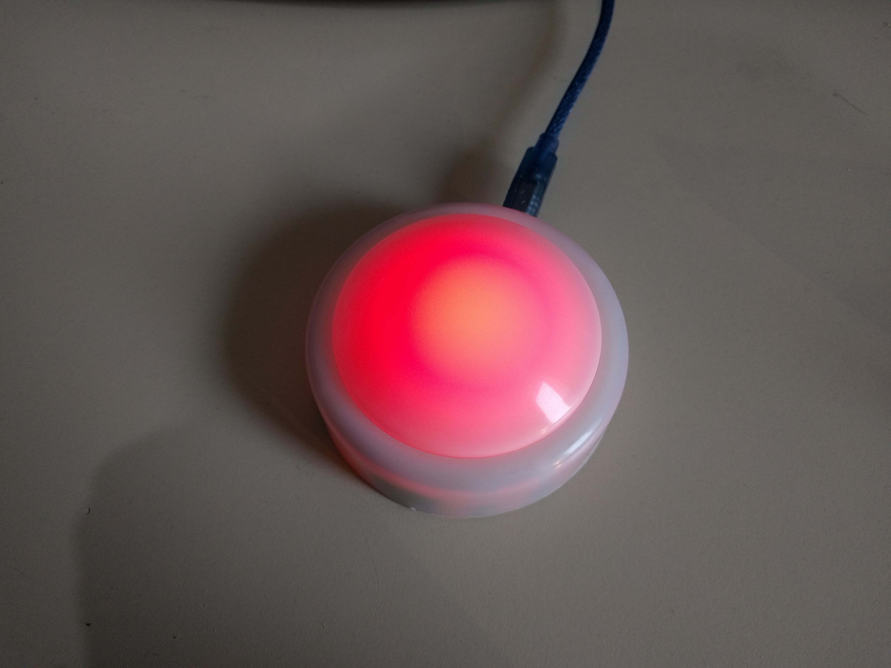
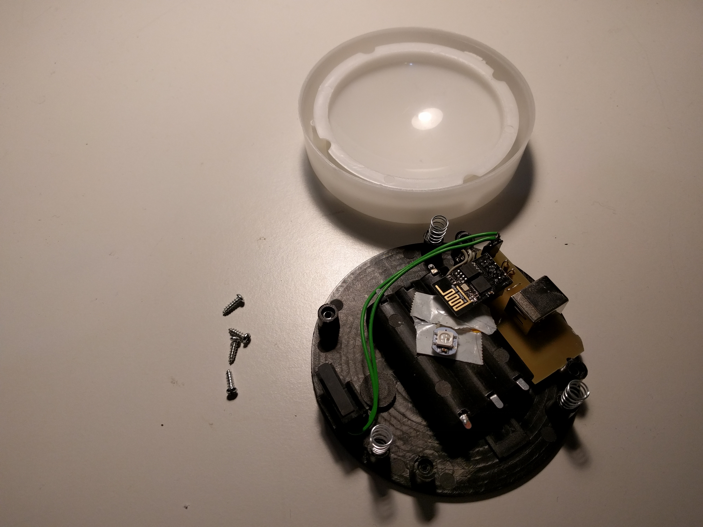
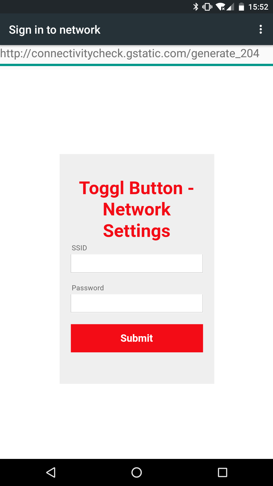
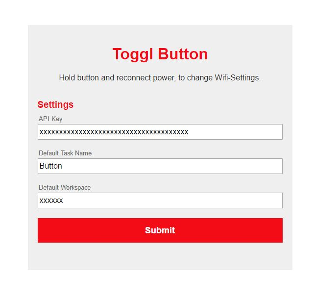
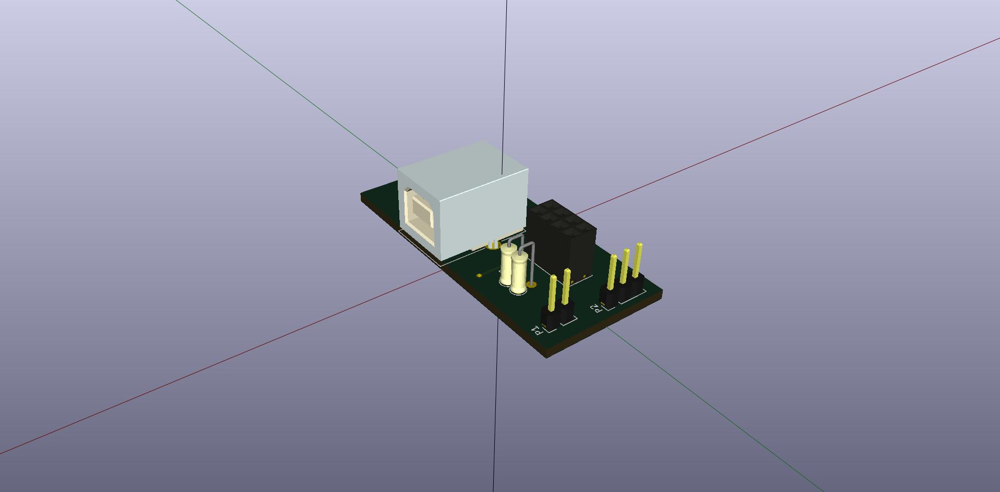
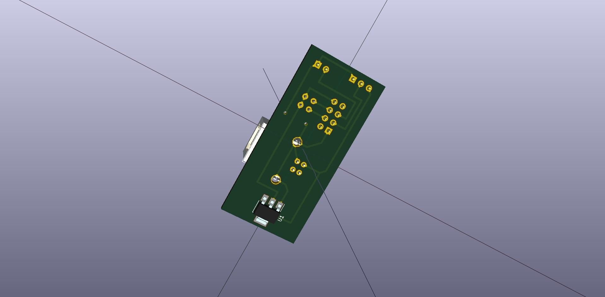

# Toggl Button

A simple button for starting and stopping tasks on toggl.

Core is a ESP8266-01 connected directly to the toggl API. In this repository you can find the sourcecode for the ESP (/software) and the schematics for the board (/hardware). A PDF version of the schematics is available in the docs folder.

I used an old LED light and replaced everything inside. The USB cable is only used for powering the ESP. Any USB power adapter is good enough to run it. After first boot, the ESP creates a hotspot and asks for credentials to connect to your WiFi. On the next settings page (available via the local ip address from the ESP) you need to specify your API key, a workspace ID and a task name. The task name is always the same, but you can later rename the tasks on the toggl homepage. Until these settings are set, the button will blink yellow.

When you start a new task, the button will light up in red. The status is synced every 30s with the toggl API, so if you create a task via the app, the button will also light up.

## UI

## Hardware

